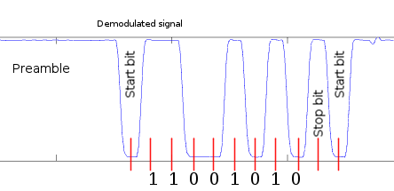

# SoftModem demodulator and decoder

## Background
The [SoftModem](https://github.com/arms22/SoftModem) library modulates data into signals with Frequency Shift Keying in the audible range. To be more exact, SoftModem uses BFSK (binary FSK, also sometimes called 2FSK) that is working with two frequencies. A binary 0 is mapped to the lower frequency and a binary 1 to the higher frequency. In the following picture we can see a recorded signal with its two frequencies.

But why do we even need this modulation and don't just pass the signal like this:

Well the reason is, that we want to transmit data via the headphone jack. This means we have a capacitively coupled link (due to safety and other reasons I will not further explain). From this we can conclude, that only alternating signals will pass the connection. So if we try to transmit the signal unmodulated, the receiver would see this:

Clearly, it is hard to detect bits correctly in this signal. For a sequence of identical bits the amplitude drops until a different bit follows. In the case of a (long) preamble the signal would fall very close to zero, making it impossible to detect its presence after a while.

## Octave reference implementation

	softmodem_read('recording.wav', braudrate, frequency_low, frequency_high)

For better understanding of the demodulation and decoding process, a reference implementation was written in the Octave language. The next paragraphs will briefly explain both processes. 

### Demodulation

First of all, we want to demodulate the signal, meaning we want to know what frequencies are present in it for every point in time. As we are only interested in two frequencies, we calculate the correlation between the received signal and a respective test signal. These are the steps for the correlation with one frequency:

1. Obtain a window of the signal with a window length close to the number of samples per bit
2. Multiply every sample with a sine and cosine of the frequency
3. Sum up all products with the sine and separately all products of the cosine multiplication 
4. Square the two sums
5. Add the squared sums
6. Take the square root of the summation
7. Save the value as first sample of the correlation
8. Move the window one sample ahead and start over

Done for both frequencies, we obtain two signals containing the information how strong the frequency in question is present in the original signal. Finally, the difference of the correlation signals is the demodulated signal. 

In the following picture we see (in this order) the recorded signal, the correlation with the lower frequency, the correlation with the higher frequency and the resulting demodulated signal.

One thing to note is the window length for the correlation process. Using a window leads to an averaged signal. Ideally the length fits to the number of samples per bit. If the length is to large, the influence from the previous and next bits will increase, which makes the resulting waveform blurred. In contrast to the demodulated signal above, the picture below shows a result with adjusted window length.

 
Now the signal is ready for decoding.

### Decoding

To understand the decoding process, let's first exlpain how data is encoded by SoftModem. This is similar to usual serial communication (UART). There are two main differences: befor sending the Start bit a (larger) Preamble is prepended and the end of a transmission is denoted by a Push bit. Omitting the Push bit means more data will follow.

| State | 1        | 0     | X  | X  | X  | X  | X  | X  | X  | X  | 1    | 1    |
|-------|----------|-------|----|----|----|----|----|----|----|----|------|------|
| Meaning | Preamble | Start | d0 | d1 | d2 | d3 | d4 | d5 | d6 | d7 | Stop | Push |

Now let's see how we can decode the demodulated signal. The decoder is build as a finite state machine with the states __PREAMBLE__, __START__, __DATA__, __STOP__. Initially it is in the state PREAMBLE. In this state the decoder trys to find the preamble by counting the samples that are larger than a certain threshold. If a preamble was detected, the decoder jumps to the middle of the Start bit and goes into the START state. There the decoder evaluates if the Start bit is set or if it jumped into the START state by mistake. In case the Start bit is set, the decoder jumps ahead for the number of samples per bit. Now the decoder position should be in the middle of the first Data bit and in state DATA. In this position it evaluates the first Data bit and consecutively the following 7 bits. Afterwards, the decoder goes into the state STOP and checks if the Stop bit was set correctly. Following, the decoder checks the Push bit. If the Push bit is set, transmission is over and we go to the PREAMBLE state. Else the next state is DATA, as a missing Push bit is the equivalent of a Start bit and indicates that the sender will continue transmitting data.

In the next picture we see the positions (red lines), where the demodulated signal will evaluated by the decoder.

There is one issue with this proceeding: synchronization. Given that the transmitter sends faster (or slower) than the decoder expects, there will be an offset and the decoder may check bits at a wrong position. This problem occurs due to rounding errors in SoftModem. A [comparison](https://docs.google.com/spreadsheets/d/1FgNwMYz1BY7YfkxdFYrwCYVjnjbC_Py1jo3o2qMi5ug/edit?usp=sharing) of different parameters leads to the conclusion that the two frequencies 4900Hz and 7350Hz work best.  